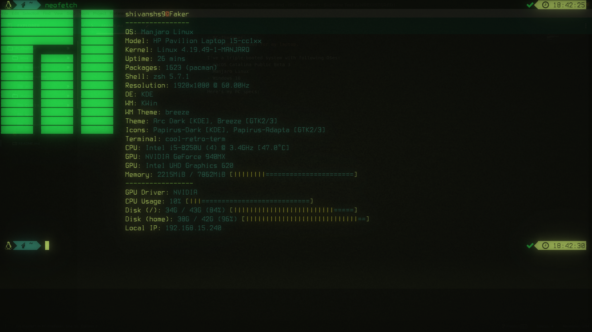
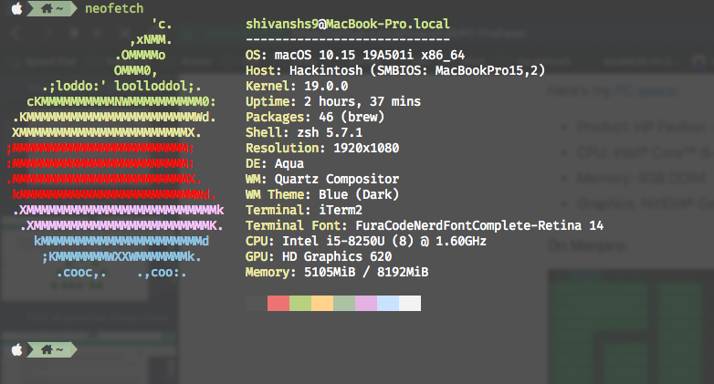

# PC-TheFaker
##### Configs used for my laptop.

### Specifications
I've a triple-booted system with following OSes:
- macOS Catalina Public Beta 3
- Manjaro Linux
- Windows 10

Here's my [PC specs](https://support.hp.com/in-en/document/c05930048):
- Product: HP Pavilion - 15-cc159tx
- CPU: Intel® Core™ i5-8250U
- Memory: 4GB DDR4
- Graphics: NVIDIA® GeForce® 940MX (4 GB DDR3 dedicated)

#### On Manjaro:

#### On macOS:

### Project Structure
**Coming soon!**
